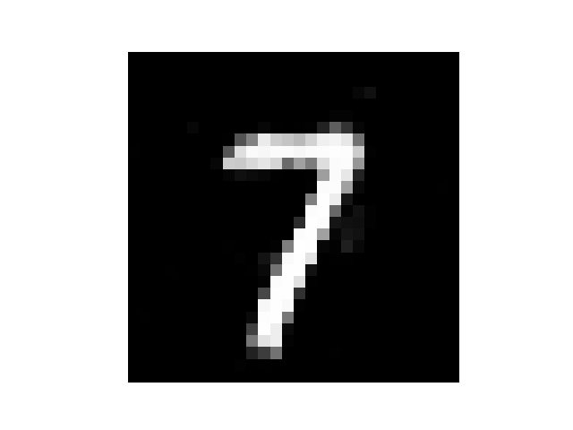
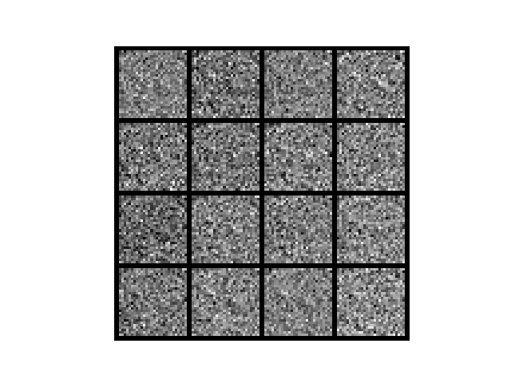
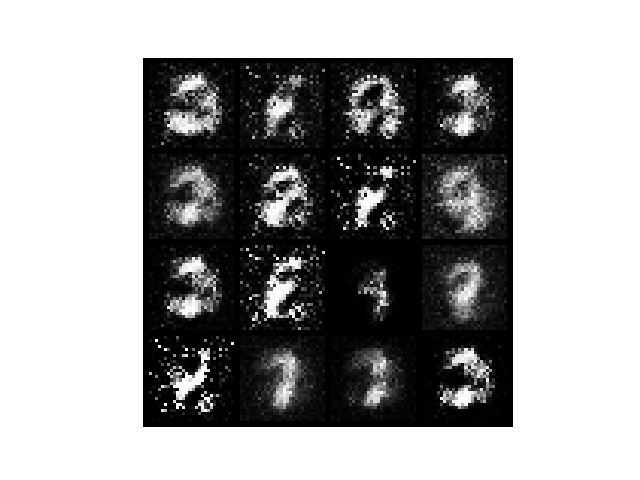
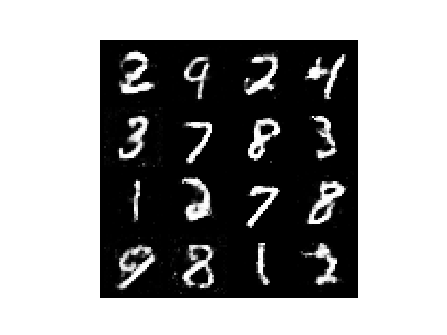
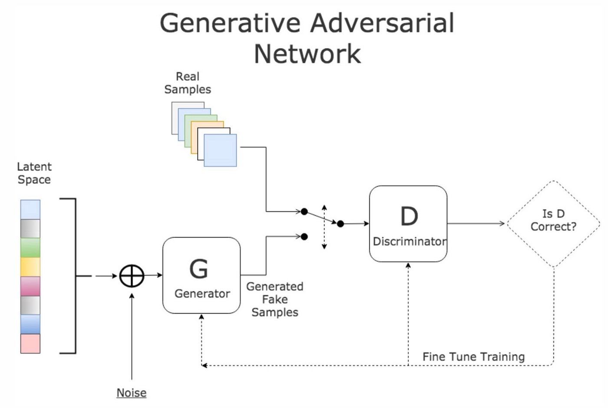

# Perceptions

A small application based on both supervised and unsupervised learning performed on MNIST dataset.

## Abstract

This application consists of two parts: 
1. **Generator**: a [GAN](https://en.wikipedia.org/wiki/Generative_adversarial_network) performing learning directly on the unlabled MNIST dataset in order to generate MNIST-like handwritten data.
2. **Recognizer**: a small neural network performing supervised learning on labeled MNIST dataset in order to recognize MNIST-like handwritten data.

## Installation

```sh
git clone https://github.com/Angold-4/Perceptrons.git
cd Perceptrons
python3 -m venv .perceptrons
source ./perceptrons/bin/activate
pip install -r requirements.txt
```

## Usage
### Run with pre-trained model
After that, you can run this application by type `python main.py <digit>`. For example:
```python
python main.py 7
python main.py 4
```
It will generate these two MNIST-like handwritten digits respectively




### Training your own model

#### Recongnizer

```
cd regcingnize
python train.py
```

For more information, you may refer to the information listed in [recongnize](https://github.com/Angold-4/Perceptrons/tree/main/recongnize).

#### Generator (gans)

```
cd gans
python train.py
```

  

**MNIST-like generated images before, middle & after training.**

## Acknowledgement

This is my first project in neural networks, although it just consists of two independent parts -- both of them can be reproduced follow some online tutorials, I still find it very useful for me to understand what deep learning is trying to do, and how to achieve that. And here I want to thanks to all of these amazing and helpful online tutorials (videos).

* **[GANs from scrach](https://medium.com/ai-society/gans-from-scratch-1-a-deep-introduction-with-code-in-pytorch-and-tensorflow-cb03cdcdba0f)** by Diego Gomez Mosquera

* **[Neural Networks and Deep Learning](http://neuralnetworksanddeeplearning.com/chap1.html)** by Michael Nielsen

* **[A Friendly Introduction to Generative Adversarial Networks (GANs)](https://www.youtube.com/watch?v=8L11aMN5KY8)** by Luis Serrano 


